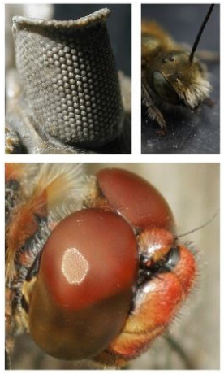
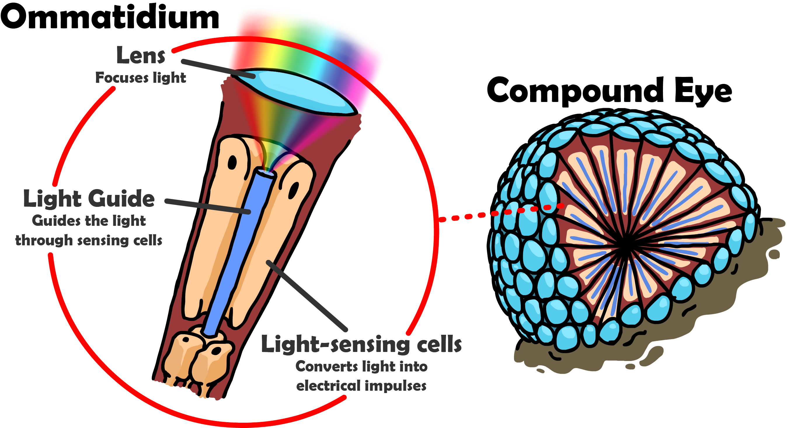
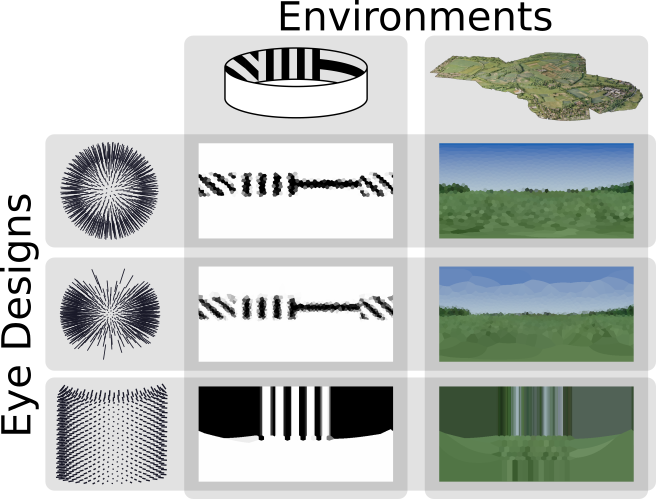

CompoundRay: Rendering From the Insect Perspective
==================================================

For further information and examples, please consult the associated paper:<br>[CompoundRay: An open-source tool for high-speed and high-fidelity rendering of compound eyes](https://www.biorxiv.org/content/10.1101/2021.09.20.461066v1)

Why Build an Insect Eye Simulator At All?
-----------------------------------------


<p style="color:#696969; font-size: 11.5px; text-align: center;">Images of real-world insect eyes, both extant and extinct. Left image credit Moussa Direct Ltd. used under the CC BY-SA 3.0 license. Middle & right image credits Matthew Barber.</p>

The way that insects see the world differs greatly from the way we do: for instance, with their compound eyes, they can see in near full panoramic vision, meaning that they can see both what's behind them and what's in front of them at the same time.
They also see at a much lower resolution than the typical human eye - you could think of the difference between an insect's vision and our own as similar to the difference between the camera on a cameraphone from the early 2000s and a camera found on a modern mobile phone of today (and yet, even that over-estimates the visual acuity of the compound eye).

<p style="clear:both">
Despite the percieved lack of image quality, insects are still capable of visual feats as complex as route navigation, recognition and avoidance, with some preying insects capable of estimating the 3D position of their targets mid-flight.
All of these tasks are performed using energy orders of magnitudes smaller than that used by modern processing units when performing similar tasks using high-resolution panoramic cameras, which makes the study of the insect visual system of great interest not just to biologists, but also roboticists.
</p>


<p style="color:#696969; font-size: 11.5px; text-align: center;">An insect's compound eye is composed of a number of tightly-packed ommatidia.</p>

Historically much work in the space of recreating insect vision for virtual experimentation and analysis has been performed with study-specific custom-made rendering systems which typically run slowly, or else make significant simplifications to the design of the eye making it difficult to comparatively explore the impact different designs have on the information available to an insect when performing tasks such as navigation and object recognition.
In particular, most all recreations have collapsed the visual field of view onto a single focal point which has then been re-sampled from, whereas in real insect eyes each ommatidia forms its own focal point.
[CompoundRay](https://www.biorxiv.org/content/10.1101/2021.09.20.461066v1) is an open-source tool that utilises hardware-accelerated real-time raytracing to estimate the light hitting each ommatidium on a compound eye, no matter it's position or individual configuration, allowing for the rendering of insect perspectives in the order of thousands of frames per second.



<p style="color:#696969; font-size: 11.5px; text-align: center;">Scenes rendered from an insect perspective using CompoundRay.</p>

Using CompoundRay
-----------------

CompoundRay in its entirety can be found at its [GitHub address](https://github.com/BrainsOnBoard/compound-ray).
An in-depth buildguide, complete with troubleshooting information for common setup issues can be found [here](https://github.com/BrainsOnBoard/compound-ray/blob/master/docs/indepth-install-notes.md).

If you use CompoundRay please cite its [associated paper](https://www.biorxiv.org/content/10.1101/2021.09.20.461066v1), the BibTex citation for which is provided below:
```
@article {Millward2021.09.20.461066,
	author = {Millward, Blayze and Maddock, Steve and Mangan, Michael},
	title = {CompoundRay: An open-source tool for high-speed and high-fidelity rendering of compound eyes},
	elocation-id = {2021.09.20.461066},
	year = {2021},
	doi = {10.1101/2021.09.20.461066},
	publisher = {Cold Spring Harbor Laboratory},
	URL = {https://www.biorxiv.org/content/early/2021/09/23/2021.09.20.461066},
	eprint = {https://www.biorxiv.org/content/early/2021/09/23/2021.09.20.461066.full.pdf},
	journal = {bioRxiv}
}
```
