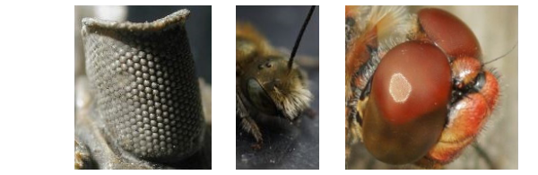

CompoundRay: A Ray-Tracing-Based System for Rendering the Insect Perspective
============================================================================

Why
---

The way that insects see the world differs greatly from the way we do - for instance, they can see in near full panoramic vision, meaning that they can see both what's behind them and what's in front of them at the same time.
They also do not see the same high-resolution image that our eyes afford, instead their compound eyes are made up of only a limited number of inter-locked visual sensing units known as ommatidium:

