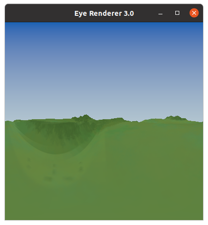
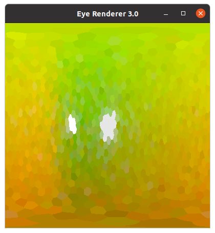
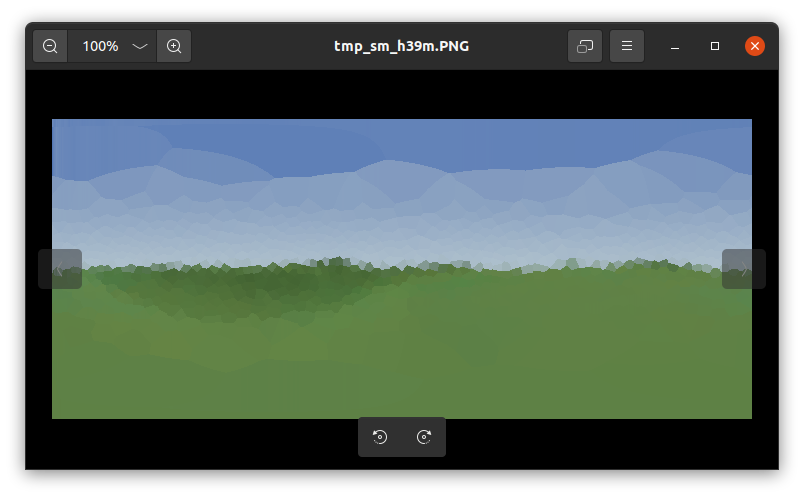

In-Depth Install Guide
======================

This install was performed on a stock Ubuntu 20.04.3 LTS system, running an Nvidia 1080Ti graphics card and AMD FX-8120 processor.
The CUDA version installed was 11.5 and the OptiX SDK version used was 7.3.0.


Pre-installation
----------------
A number of requirements must be installed before building the CompoundRay system.

**General Dependencies**
Freeglut development packages must be installed before the CUDA framework can be built. To install this run:
```
$ sudo apt install freeglut3-dev
```

You may find that freeglut cannot be found, in which case make sure you've added the _universe_ PPA using:
```
$ sudo add-apt-repository universe
```

The Nvidia Optix SDK requires a number of dependencies to be installed beforehand, this should be installable by running
```
$ sudo apt install libxrandr-dev libxinerama-dev libxcursor-dev 
```

To get a copy of CompoundRay, git should be installed on the machine. This is accessible via:
```
$ sudo apt install git
```

**Nvidia Drivers**
You must make sure that Nvidia drivers are installed and loaded. This is possible via Ubuntu's _Additional Drivers_ utility, which is accessible via the application search menu.

**Nvidia CUDA**
The minimum required CUDA installs can be built by following the [Cuda Quickstart Guide](https://docs.nvidia.com/cuda/cuda-quick-start-guide/index.html). Using the [Cuda Download Tool](https://developer.nvidia.com/cuda-downloads) is recommended to get the correct download urls.

For this install CUDA 11.5 was installed.

The installation can be checked by running `nvcc --version` and the Nvidia CUDA samples, specifically the DeviceQuery sample can be run to check that the install is running properly and can see your graphics card(s).

**Nvidia OptiX SDK**
[Download](https://developer.nvidia.com/designworks/optix/download) and extract the Nvidia OptiX SDK to a place of your choosing. In this install it was installed to `~/`.

With the OptiX SDK downloaded and installed, it's functionality can be checked by building and running the included SDK examples. To do this, first the makefiles must be built by running `cmake`. First create a new directory called `build` within the NVIDIA-OptiX-SDK-\* folder and then entering it before running `$ cmake ../` which will build a _make_-compilable project, which can then be compiled by running `$ make`. All of these steps look like this:
```
$ cd ~/NVIDIA-OptiX-SDK-*
$ mkdir build
$ cmake ../
$ make
```
Note that any unmet dependencies will raise in the `cmake` phase, so some packages may need to be installed and `cmake` run again if a package is missing.

Once the SDK examples have been built, the samples can be seen by running the demos found in the `bin` within the `build` folder that was just created. It is suggested that you run `optixHello` or the `optixMeshViewer` to check that the SDK has been sucessfully built.


Compilling CompoundRay
----------------------

Clone the _CompoundRay_ gitHub repository with `$ git clone https://github.com/ManganLab/eye-renderer.git`.
Then, navigate into the `build` folder and observe the notes in `build-notes.txt`.
In this case we are reminded to set the `OptiX_INSTALL_DIR` (A build variable used as a first choice when cmake is attempting to find the OptiX SDK) on line 38 of the `FindOptiX.cmake` file under `eye-renderer/CMake/`.
Our OptiX SDK was stored in ~/, so the `OptiX_INSTALL_DIR` was set to:
```
set(OptiX_INSTALL_DIR "~/NVIDIA-OptiX-SDK-7.3.0-linux64-x86_64")
```
We are also asked to configure the appropriate Nvidia architecture flags (in particular their reference to architecture choice, switched with the `-arch` switch), in this case `CUDA_NVCC_FLAGS` and `CUDA_NVRTC_FLAGS`, both present in `eye-renderer/CmakeLists.txt` (lines 146 and 188 as of this writing), set to `sm_60` and `compute_60` by default.
Looking up on the [GPU feature list](https://docs.nvidia.com/cuda/cuda-compiler-driver-nvcc/index.html#gpu-feature-list) and [virtual architecture feature list](https://docs.nvidia.com/cuda/cuda-compiler-driver-nvcc/index.html#virtual-architecture-feature-list) (more info on those [here](https://arnon.dk/matching-sm-architectures-arch-and-gencode-for-various-nvidia-cards/)), we can see that the 1080Ti (which uses Pascal architecture) is an `*_60` card, so the lines are kept as:
```
list(APPEND CUDA_NVCC_FLAGS -arch sm_60)
.
.
.
set(CUDA_NVRTC_FLAGS ${EYE_RENDERER_NVRTC_CXX} -arch compute_60 -use_fast_math -lineinfo -default-device -rdc true -D__x86_64 CACHE STRING "Semi-colon delimit multiple arguments." FORCE)
```

With these cmake scripts configured, we can now build the renderer. This is done here by navigating into `eye-renderer/build/make` and running `$ cmake ../../` (although running `$ cmake -G "Ninja" ../../` will build a ninja-based project instead of a make-based project if you wish to use ninja. It is recommended that you do this in the `eye-renderer/build/ninja` folder. You must first install the ninja-build package to do this).
Ensure that the files have been built correctly and in particular note that OptiX was found (note that it may not find OptiX initially, throwing a warning to specify the OptiX path, but then might find it afterwards. If the line `-- Found OptiX` is present, then the OptiX SDK was found), and that the correct version of CUDA was found (here version 11.5).

From this point CompoundRay can be compiled by running `$ make` from the make folder (or `$ ninja` from the ninja folder).


Confirming the Build
--------------------

**Simple GUI usage**
Once CompoundRay has been built using `$ make`, a build can be confirmed by navigating to the `eye-renderer/build/make/bin` (or `eye-renderer/build/ninja/bin`) folder and running `$ ./newGuiEyeRenderer -f natural-standin-sky` or `$ ./newGuiEyeRenderer -f test-scene/test-scene.gltf`, which should start a new instance of the guiEyeRenderer (which at this point only renders static images from each camera, with each camera navigable by pressing 'n' and 'b' for 'next' and 'back', with page up and down used to increase/decrease per-ommatidial sample rate, with 'c' capturing an output and saving it as 'output.ppm' in the folder the program is run from):




**Python Bindings Usage**
Next ensure that Python is installed along with the [Numpy](https://numpy.org/install/) and [Pillow](https://pillow.readthedocs.io/en/stable/installation.html) packages.
Then navigate to `eye-renderer/python-examples/alias-demonstration` and run `viewpoint-experiment.py`. Note that to do so you have to have `eye-renderer/python-examples/` in your `$PYTHONPATH` system variable. To do this from the `alias-demonstration` folder simply run:
```
export PYTHONPATH=$(cd ../ && pwd)
```
At which point you should be ready to run the example via:
```
python3 viewpoint-experiment.py
```

`output/generated-data/alias-demonstration` should now be populated, and you should be able to see the image below:


