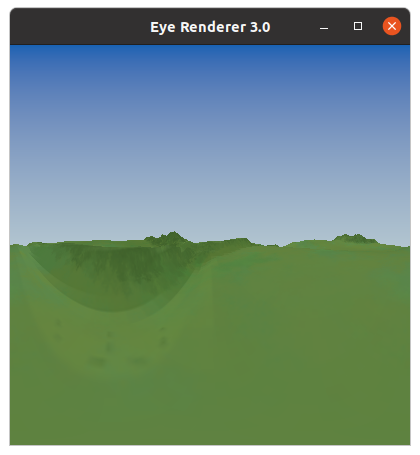
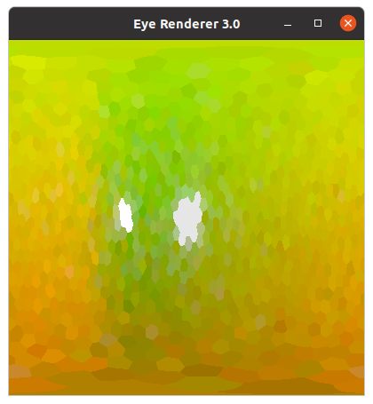
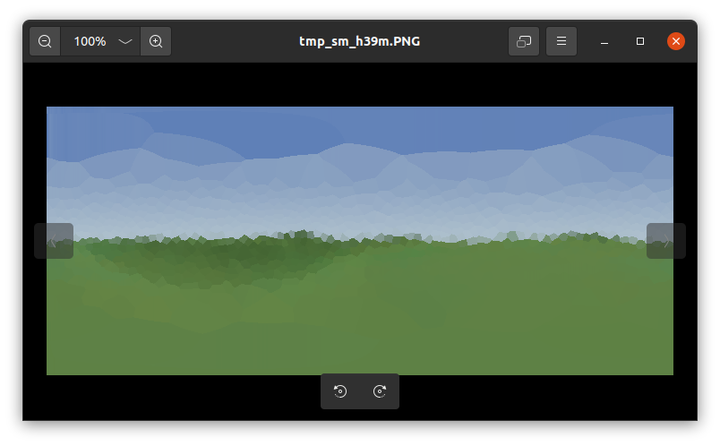
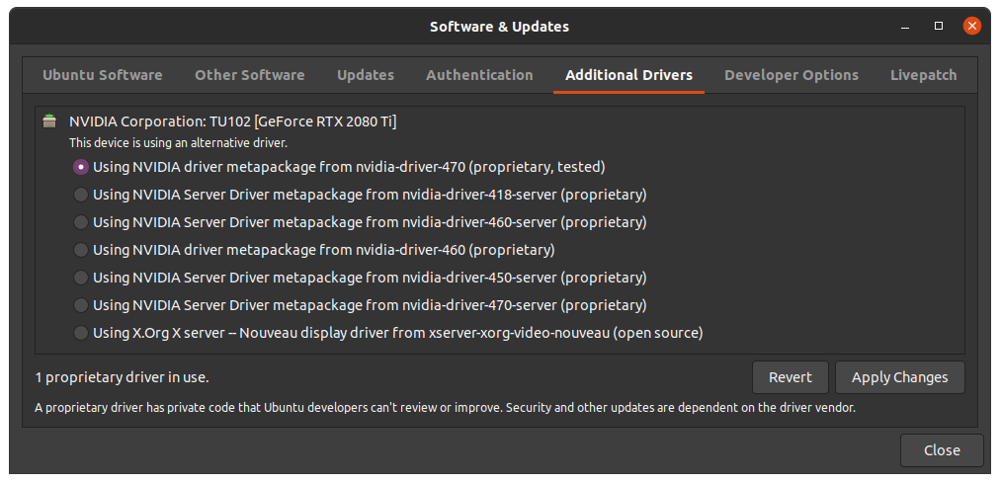

In-Depth Install Guide
======================

This install was performed on a stock Ubuntu 20.04.3 LTS system, running an Nvidia 1080Ti graphics card (_Pascal_ architecture, with architecture integer _60_) on driver version 470 and an AMD FX-8120 processor.
The CUDA version installed was 11.5 and the OptiX SDK version used was 7.3.0.

Installation time is about 30 minutes.

The minimum requirements this install requires are:
* An NVidia graphics driver greater than version 465.84
* gcc/g++ 8 (Edit: 10 or earlier now seems to be supported by the NVidia compiler) (note that this is older than may be installed on your machine. See _Troubleshooting - Compilling_ for the reasoning on this and a guide to setting up alternative compilers quickly - if you're unsure, run `gcc --version` to list the version of gcc you are using).
* A Nvidia graphics card that supports driver version 465.x and up (typically including and newer than the GTX 10XX series, although you may get performance out of older cards)
* A CUDA version 5.0 or greater install.
* While not _required_, A version of Ubuntu at 18.04 or newer is recommended.

However, the versions used in this install (Ubuntu 20.04.3 LTS, Nvidia driver 470.x, CUDA 11.5 and OptiX SDK 7.3.0) are the recommend versions (and it is assumed that versions newer than this should also work correctly - most at risk of this is the OptiX SDK, which has suffered backwards-compatability issues in the past).


**Tested Environment Variations**

Tested Ubuntu versions: 20.04.03, 20.04.02, 22.04.02<br>
Tested Graphics Cards: GTX 1080Ti, GTX 1060, RTX 2080Ti, GeForce GT 10, RTX 3090<br>
Tested Driver versions: 470, 495, 515<br>
Tested CUDA versions: 11.5, 11.4<br>
Tested OptiX SDK versions: 8.0.0 (Due to breaking changes within the NVIDIA OptiX SDK 7.4.0 7.3.0, 7.2.0 are no longer supported)<br>

Feel free to add your own configuration information to these lists via pull request to help others!

Pre-installation
----------------
A number of requirements must be installed before building the CompoundRay system.

**General Dependencies**

Freeglut development packages must be installed before the CUDA framework can be built. To install this run:
```
$ sudo apt install freeglut3-dev
```

You may find that freeglut cannot be found, in which case make sure you've added the _universe_ PPA using:
```
$ sudo add-apt-repository universe
```

The Nvidia Optix SDK requires a number of dependencies to be installed beforehand, this should be installable by running
```
$ sudo apt install libxrandr-dev libxinerama-dev libxcursor-dev
```

To get a copy of CompoundRay, git should be installed on the machine. This is accessible via:
```
$ sudo apt install git
```

**Nvidia Drivers**

You must make sure that new (version 535.x and above) Nvidia drivers are installed and loaded. This is possible via Ubuntu's _Additional Drivers_ utility, which is accessible via the application search menu. See the "Troubleshooting - Running : OPTIX_ERROR_UNSUPPORTED_ABI_VERSION" section of this document for more information.

**CUDA**

The minimum required CUDA installs can be built by following the [Cuda Quickstart Guide](https://docs.nvidia.com/cuda/cuda-quick-start-guide/index.html#ubuntu-x86_64). Using the [Cuda Download Tool](https://developer.nvidia.com/cuda-downloads) is recommended to get the correct download urls.

For this install CUDA 11.5 was installed.

The installation can be checked by running `nvcc --version` and the Nvidia CUDA samples, specifically the DeviceQuery sample can be run to check that the install is running properly and can see your graphics card(s).

Note that the Cuda Quickstart Guide suggests that you "Set up the development environment by modifying the PATH and LD_LIBRARY_PATH variables" and gives a bash snippet to do so:
```
$ export PATH=/usr/local/cuda-11.5/bin${PATH:+:${PATH}}
$ export LD_LIBRARY_PATH=/usr/local/cuda-11.5/lib64\
                         ${LD_LIBRARY_PATH:+:${LD_LIBRARY_PATH}}
```
I strongly recommend that you place this code somewhere that it will either be run automatically on log-on (i.e. in your `~/.bashrc` or `~/.bash_aliases` files which can then be re-sourced to using `$ source .bashrc`) or in a bash file that you can easily execute yourself (for instance in `~/Documents/linkCuda.sh`) so you can make sure the Cuda libraries are visible to CompoundRay and any other programs that might use them even after you reboot your system.


**Nvidia OptiX SDK**

[Download](https://developer.nvidia.com/designworks/optix/download) and extract the Nvidia OptiX SDK to a place of your choosing. In this install it was extracted to `~/`.

With the OptiX SDK downloaded and installed, it's functionality can be checked by building and running the included SDK examples. To do this, first the makefiles must be built by running `cmake` from a build folder. First create a new directory called `build` within the `NVIDIA-OptiX-SDK-\*/SDK` folder and then enter it before running `$ cmake ../` which will build a _make_-compilable project, which can then be compiled by running `$ make -j 8` (the `-j 8` is simply to run the compilation in parallel, and can be ommitted if it causes issues on your system). All of these steps look like this:
```
$ cd ~/NVIDIA-OptiX-SDK-*/SDK
$ mkdir build
$ cd build
$ cmake ../
$ make -j 8
```
Note that any unmet dependencies will raise in the `cmake` phase, so some packages may need to be installed and `cmake` run again if a package is missing.

Once the SDK examples have been built and compiled (by running `$ make`), the samples can (and should, to verify correct installtion) be run by executing them from within thier compile location - the `bin` folder within the `build` folder that was just created. It is suggested that you run `optixHello` or the `optixMeshViewer` (by executing `$ ./bin/optixHello` or `$ ./bin/optixMeshViewer` from the `build` folder) to check that the SDK has been sucessfully built.


Compiling CompoundRay
----------------------

Clone the _CompoundRay_ gitHub repository with `$ git clone git@github.com:BrainsOnBoard/compound-ray.git`.
Then, navigate into the `build` folder and notice the the notes in `build-notes.txt`.
These provided a small selection of hints to things that may go wrong and provide further information should compilation fail.

It is important that we set the `OptiX_INSTALL_DIR`(A build variable used as a first choice when cmake is attempting to find the OptiX SDK). The easiest way to change this is to pass a vairable through cmake to specify an install directory, for instance `$ cmake -DOptiX_INSTALL_DIR=/path/to/install/NVIDIA-OptiX-SDK-7.3.0-linux64-x86_64/ [ other build options ...]` would explicitly look in `/path/to/install/NVIDIA-OptiX-SDK-7.3.0-linux64-x86_64/` for OptiX.
See **Manually specifying the OptiX install location** under **Troubleshooting - Building** below for further information on manually changing this within the build script.


We are also asked to configure the appropriate Nvidia architecture compilation flags which control the compilation process run under NVCC and NVRTC.
The most important part to configure is the architecture flag that tells these compilers which NVidia GPU architecture you are using, this can be specified with the `ARCH_INT` flag, for instance calling `cmake -DARCH_INT=75 [other build options ...]` would compile against the NVidia _Turing_ series of GPU architecture (which has an architecture integer ID of _75_). See the below table for a list of suggested architecture integers for various graphics cards and architectures.
Note that some graphics cards have multiple architecture integers which may require experimentation, however the most likely to work flag has been given first below:

| Graphics Card(s) | Architecture name | suggested architecture integer |
|------------------|-------------------|--------------------------------|
| GeForce 600, 700, GTX Titan Series| Kepler | 35 (or 37)|
| GeForce 750, 900 Series | Maxwell | 50 (or 52,53) |
| GeForce 10XX Series (1060, 1070, 1080 etc.)| Pascal | 60 (or 61,62) |
| Titan V, Quadro GV100 | Volta | 70 (or 72) |
| GeForce RTX 20XX Series (2070, 2080 etc.), GTX 16XX Series (1650, 1660 etc.) | Turing | 75 |
| GeForce RTX 30XX Series (3080, 3090 etc.) | Ampere | 80 (or 86, 87) |

To find out the name of your currently installed graphics card, run `lspci | grep -i "VGA"` and observe the name in square brackets.
If you have more than one graphics card installed in your system, you may want to see the Buffer Type table at the end of this guide that outlines an additional switch, `-DBUFFER_TYPE`, that is often required to be specified in multi-gpu systems.
If you are unsure but have multiple graphics cards installed, attempt compilation and execution without adding this switch, and then refer to **[ERROR: GL interop is only available on display device](#bufferTableError)** if issues arise on execution.

With switches considered, we can now build the renderer. This is done here by navigating into `compound-ray/build/make` and running `$ cmake ../../`.
For instance, with the system configuration we are using in this guide, our OptiX install location is `~/NVIDIA-OptiX-SDK-7.3.0-linux64-x86_64/` and our installed graphics card is the NVidia GTX 1080Ti, which is operating on the Pascal architecture, meaning it requires architecture integer `60`.
This means that our build command (as run from the `compound-ray/build/make` folder looks like this:
```
$ cmake ../../ -DOptiX_INSTALL_DIR=~/NVIDIA-OptiX-SDK-7.3.0-linux64-x86_64/ -DARCH_INT=60
```

Ensure that the files have been built correctly and in particular note that OptiX was found (note that it may not find OptiX initially, throwing a warning to specify the OptiX path, but then might find it afterwards. If the line `-- Found OptiX` is present, then the OptiX SDK was found), and that the correct version of CUDA was found (here version 11.5).

From this point CompoundRay can be compiled by running `$ make -j 8` (the `-j 8` is simply to run the compilation in parallel, and can be ommitted if it causes issues on your system) from the make folder.

The full list of commands entered should look like this (when starting in the compound-ray folder):
```
$ cd build/make
$ cmake ../../ -DOptiX_INSTALL_DIR=~/NVIDIA-OptiX-SDK-7.3.0-linux64-x86_64/ -DARCH_INT=60
$ make -j 8
```
Refer to the "compile" section under **Troubleshooting** below if you have further issues when attempting to compile the code.


Confirming the Build
--------------------

**Simple GUI usage**

Once CompoundRay has been built using `$ make`, a build can be confirmed by navigating to the `compound-ray/build/make/bin` folder and running `$ ./newGuiEyeRenderer -f natural-standin-sky.gltf` or `$ ./newGuiEyeRenderer -f test-scene/test-scene.gltf`, which should start a new instance of the guiEyeRenderer (which at this point only renders static images from each camera, with each camera navigable by pressing 'n' and 'b' for 'next' and 'back', with page up and down used to increase/decrease per-ommatidial sample rate, with 'c' capturing an output and saving it as 'output.ppm' in the folder the program is run from):




**Python Bindings Usage**

Next ensure that Python is installed along with the [Numpy](https://numpy.org/install/) and [Pillow](https://pillow.readthedocs.io/en/stable/installation.html) packages.
Then navigate to `compound-ray/python-examples/alias-demonstration` and run `viewpoint-experiment.py`. Note that to do so you have to have `compound-ray/python-examples/` in your `$PYTHONPATH` system variable. To do this from the `alias-demonstration` folder simply run:
```
export PYTHONPATH=$(cd ../ && pwd)
```
At which point you should be ready to run the example via:
```
python3 viewpoint-experiment.py
```

`output/generated-data/alias-demonstration` should now be populated, and you should be able to see the image below:



Troubleshooting - Building
--------------------------

Sometimes when re-building using cmake, built information can be left over from the previous project build.
It is suggested that you run either `make clean` from within the _make_ folder between installations, or when changing cmake-related files, you might find it more reliable to run `rm -rf *` from within the _make_ folder to completely delete all of the build's configuration contents (note that this is irreversible, and you should always ensure you are actually within a folder you wish to perminently delete all contents of before running this command).
If you are still unsure of what variables are being passed to the compilation command, run `make VERBOSE=` to compile in verbose mode, which will show all switches sent to the compilers.
In particular the `-arch sm_*` compiler switch when compiling the .ptx files can be a point of contention.

**Manually specifying the OptiX install location**

The `OptiX_INSTALL_DIR` variable is configured on line 38 of the `FindOptiX.cmake` file under `compound-ray/CMake/`.
In the example install above, the OptiX SDK was stored in ~/, so the `OptiX_INSTALL_DIR` could have been set to:
```
set(OptiX_INSTALL_DIR "~/NVIDIA-OptiX-SDK-7.2.0-linux64-x86_64/" CACHE STRING "The full path (including the OptiX-SDK folder) to your NVidia OptiX install location.")
```

**Manually specifying the architecture integers**


We are also asked to configure the appropriate Nvidia architecture flags (in particular their reference to architecture choice, switched with the `-arch` switch), in this case `CUDA_NVCC_FLAGS` and `CUDA_NVRTC_FLAGS`, both present in `compound-ray/CmakeLists.txt` (lines 151 and 193 as of this writing), set `-arch` to `sm_${ARCH_INT}` and `compute_${ARCH_INT}` by default (`ARCH_INT` evaluates to "60" by default).
Looking up on the [GPU feature list](https://docs.nvidia.com/cuda/cuda-compiler-driver-nvcc/index.html#gpu-feature-list) and [virtual architecture feature list](https://docs.nvidia.com/cuda/cuda-compiler-driver-nvcc/index.html#virtual-architecture-feature-list) (more info on those [here](https://arnon.dk/matching-sm-architectures-arch-and-gencode-for-various-nvidia-cards/) or for a quick-guide, consult the table below), we can see that the 1080Ti (which uses Pascal architecture) is an `*_60` card, so we would write the lines as:
```
list(APPEND CUDA_NVCC_FLAGS -arch sm_60)
.
.
.
set(CUDA_NVRTC_FLAGS ${EYE_RENDERER_NVRTC_CXX} -arch compute_60 -use_fast_math -lineinfo -default-device -rdc true -D__x86_64 CACHE STRING "Semi-colon delimit multiple arguments." FORCE)
```

The below table shows sm and compute architecture flags (bracketed versions are required for some variants, but a comprehensive list of graphics card to flags is difficult to assemble, so some trial and error may be required):

| Graphics Card(s) | Architecture name | sm architecture flag | compute architecture flag |
|------------------|-------------------|----------------------|---------------------------|
| GeForce 600, 700, GTX Titan Series| Kepler | sm_35 (or sm_37)| compute_35 (or compute_37)|
| GeForce 750, 900 Series | Maxwell | sm_50 (or sm_52,sm_53) | compute_50 (or \_52, \_53) |
| GeForce 10XX Series (1060, 1070, 1080 etc.)| Pascal | sm_60 (or sm_61,sm_62) | compute_60 (or \_61, \_62) |
| Titan V, Quadro GV100 | Volta | sm_70 (or sm_72) | compute_70 (or \_72) |
| GeForce RTX 20XX Series (2070, 2080 etc.), GTX 16XX Series (1650, 1660 etc.) | Turing | sm_75 | compute_75 |
| GeForce RTX 30XX Series (3080, 3090 etc.) | Ampere | sm_80 (or \_86, \_87) | compute_80 (or \_86, \_87) |

This chart is formed from the data found [here](https://nouveau.freedesktop.org/CodeNames.html) listing graphics cards and their architecture names and comparing against Nvidia the [GPU feature list](https://docs.nvidia.com/cuda/cuda-compiler-driver-nvcc/index.html#gpu-feature-list) and [virtual architecture feature list](https://docs.nvidia.com/cuda/cuda-compiler-driver-nvcc/index.html#virtual-architecture-feature-list).

Note that the default OptiX location is `~/NVIDIA-OptiX-SDK-7.3.0-linux64-x86_64/` and the default GPU arcitecture integer is `60`.

Troubleshooting - Compilling
----------------------------

**#error -- unsupported GNU version! gcc versions later than 8 are not supported!**

Note: stdio.h errors (such as "__malloc__" not taking arguments) can result as an effect of using a newer gcc version. Please check your gcc version by running `gcc --version`.

This error occurs because the Nvidia compiler, _nvcc_, cannot compile against newer features of C++ included in the C++ standard library found in versions of `gcc` and `g++` later than 8.
In effect, you cannot install this software (nor any Nvidia nvcc-based software) using gcc and g++ versions higher than 8.
[This guide](https://linuxconfig.org/how-to-switch-between-multiple-gcc-and-g-compiler-versions-on-ubuntu-20-04-lts-focal-fossa) explains how to set up your system for switching between gcc versions, however the key parts are to first install the old gcc/g++ version:
```
$ sudo apt install build-essential
$ sudo apt -y install gcc-8 g++-8
```
And then add the two versions of gcc and g++ (here I am assuming that your current version of gcc/g++ is 9, however this could be any number. You can check your current version of gcc/g++ by running `gcc --version`) to the `update-alternatives` tool:
```
sudo update-alternatives --install /usr/bin/gcc gcc /usr/bin/gcc-8 8
sudo update-alternatives --install /usr/bin/g++ g++ /usr/bin/g++-8 8
sudo update-alternatives --install /usr/bin/gcc gcc /usr/bin/gcc-9 9
sudo update-alternatives --install /usr/bin/g++ g++ /usr/bin/g++-9 9
```
Which now enables you to switch gcc and g++ versions using the `sudo update-alternatives --config gcc` and `sudo update-alternatives --config g++` commands.

<p id="ccErrors"><strong>cc1plus and Preprocessor Errors</strong></p>

A number of CC and GCC configuration errors will result in similar messages to the below:
```
cc: error trying to exec 'cc1plus': execvp: No such file or directory
nvcc fatal   : Failed to preprocess host compiler properties.
CMake Error at cuda_compile_ptx_generated_whitted.cu.ptx.cmake:251 (message):
  Error generating
  /home/blayze/Documents/PhD-Work/compound-ray/build/make/lib/ptx/cuda_compile_ptx_generated_whitted.cu.ptx


make[2]: *** [sutil/CMakeFiles/sutil_7_sdk.dir/build.make:65: lib/ptx/cuda_compile_ptx_generated_whitted.cu.ptx] Error 1
make[1]: *** [CMakeFiles/Makefile2:379: sutil/CMakeFiles/sutil_7_sdk.dir/all] Error 2
make: *** [Makefile:84: all] Error 2
```
This is most likely due to a mal-linked compilation toolchain (particularly with the gcc/g++ 8 version if you are using something like `update-alternatives` to manage alternative buildchains to run gcc/g++ 8 alongside some other version of gcc/g++), and can generally be fixed by first re-installing `build-essential` by running `sudo apt install --reinstall build-essential` and then re-configuring `update-alternatives` by running the `sudo update-alternatives --install /usr/bin/gcc gcc /usr/bin/gc...` etc commands seen under the **#error -- unsupported GNU version! gcc versions later than 8 are not supported!** troubleshooting section above.

This issue can apparently also be attributed to limited disk space in the apt cache, which can be eased by running:
```
$ sudo apt clean
$ sudo apt autoremove
```


Troubleshooting - Running
-------------------------

**OPTIX_ERROR_UNSUPPORTED_ABI_VERSION**

The primary cause of this error is running CompoundRay on an NVidia driver less than version 465.84, which is required for NVidia OptiX 7.3.x to run. You can see what version of the NVidia graphics drivers you are running by looking in the "Additional Drivers" tab of the "Software & Updates" utility under Ubuntu:

You can also find your currently in-use driver version by running `nvidia-smi`, which should produce something similar to the below, where you can find your current driver version in the top middle:
```
+-----------------------------------------------------------------------------+
| NVIDIA-SMI 470.42.01   Driver Version: 470.42.01   CUDA Version: 11.0       |
|-------------------------------+----------------------+----------------------+
| GPU  Name        Persistence-M| Bus-Id        Disp.A | Volatile Uncorr. ECC |
| Fan  Temp  Perf  Pwr:Usage/Cap|         Memory-Usage | GPU-Util  Compute M. |
|                               |                      |               MIG M. |
|===============================+======================+======================|
|   0  GeForce RTX 208...  Off  | 00000000:08:00.0  On |                  N/A |
| 17%   54C    P8    43W / 250W |    402MiB / 11011MiB |     17%      Default |
|                               |                      |                  N/A |
+-------------------------------+----------------------+----------------------+
```
(Note the captured image above and terminal output were taken on a different computer to the rest of this guide, hence the CUDA version of 11.0 and the presence of an RTX 2080Ti)

Again in the "Software & Updates" Additional drivers utility you can simply select a newer version of the NVidia drivers (driver version numbers are written on the end of each driver name). Note that you may have to select an option to "allow the use of proprietry drivers" or similar. Also note that if this list is not populated with proprietry NVidia drivers (i.e. you only see the free "Nouveau" driver) you may have to add the nvidia drivers PPA to Ubuntu's package manager, which is actually performed in the NVidia CUDA install section of this guide.


**GLFW Error 65543: GLX: Failed to create context: BadValue (integer parameter out of range for operation)**

This error appears to occur when you have a mal-loaded NVidia driver. Fixes can be as simple as re-booting if you are part-way through the driver installation process (or have altered your driver settings without a restart), or may require re-installation of the latest supported NVidia drivers. In particular, ensure that you are actually running Nvidia drivers.


<p id="bufferTableError"><strong>ERROR: GL interop is only available on display device</strong></p>

This error occurs because by default the eye renderer builds in a GL interoperation mode, which is the preferred option for a single-device (GPU) computer system.
If you are seeing this error it may be because you are using a multi-GPU system or an NVidia graphics compute card that is not being used to drive your display.
You can rebuild the project (see the cmake steps under **Compiling CompoundRay**) with the additional `BUFFER_TYPE` flag that allows for you to specify the output buffer type.
A good start is the `ZERO_COPY` buffer type, which would be switched like so: `cmake -DBUFFER_TYPE=BUFFER_TYPE_ZERO_COPY [other build options ...]`.
The table below shows some information about the difference options available and their suited system configurations:

| Buffer Type | Comments |
|-------------|----------|
| BUFFER_TYPE_CUDA_DEVICE | Can be used to specify when a single Cuda-compatible device is in use that might not neccissarily be the display device. Not preferred, typically slower than ZERO_COPY. |
| GL_INTEROP | Single device only, preferred for single device use. |
| ZERO_COPY | The most general use-case, preferred for multi-gpu systems if not fully nvlink connected. |
| CUDA_P2P | Only to be used in fully nvlink connected envrionments. |
